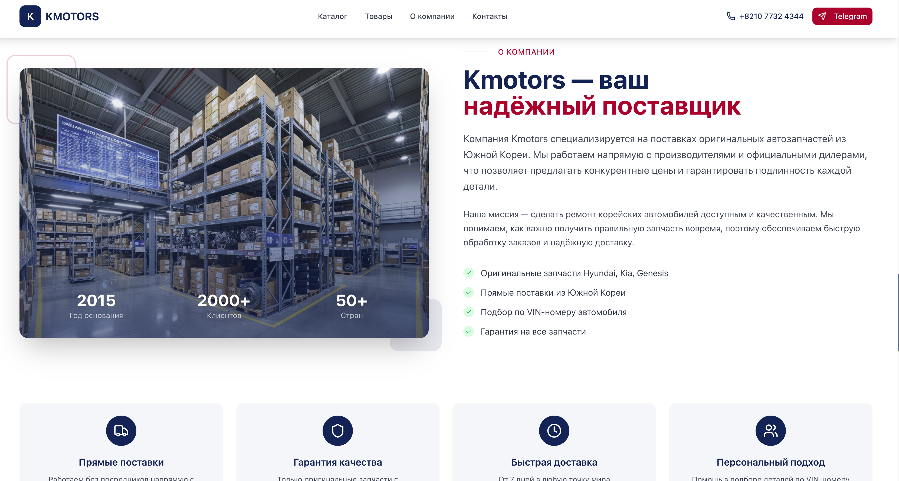
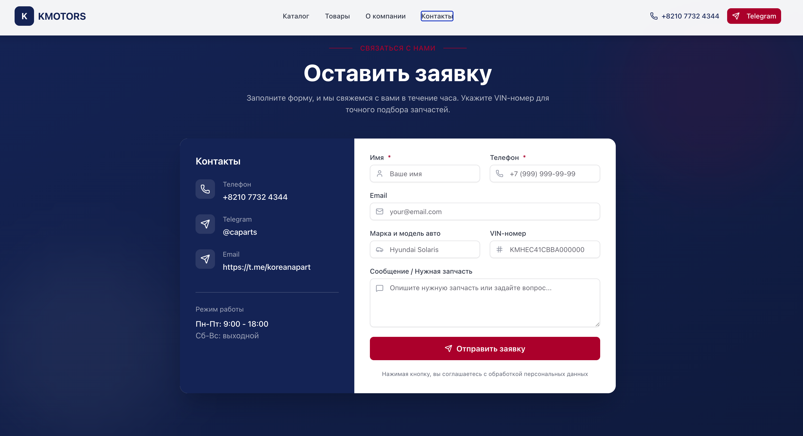
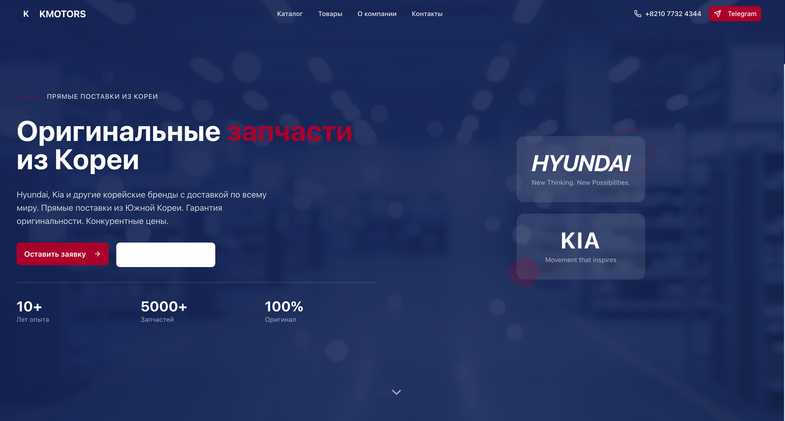
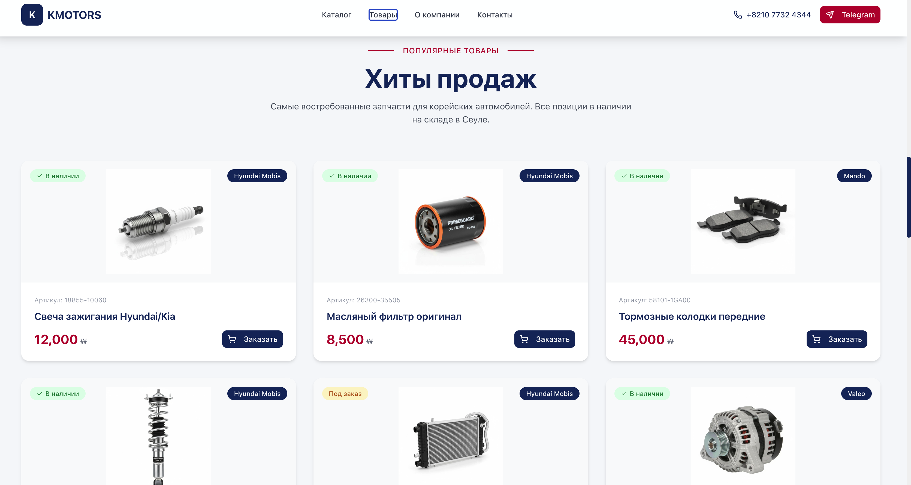

# KMotors Parts — Korean Car Parts Landing Page

> **Live demo:** [kmotorsparts.vercel.app](https://kmotorsparts.vercel.app)
>
> Single-page application for a Korean auto parts export business. Built with React + Vite + shadcn/ui. Includes a parts catalog by category, product showcase with OEM part numbers, and a contact form with Telegram notifications.

**Part of the [KMotors](https://github.com/Nikolanikol/KMotors) ecosystem** — the main platform for Korean used car sales and export.

## Screenshots






---

## Features

- **Parts catalog** — 8 categories: engine, body, suspension, brakes, transmission, electrical, filters, lighting
- **Product showcase** — OEM part numbers, prices in KRW, brand (Hyundai Mobis, Mando, etc.), stock status
- **Contact form** — fields for car model and VIN, Telegram notification via Vercel serverless function
- **Parallax hero** — scroll-based animation on the hero section
- **Advantages section** — direct supply, quality guarantee, 7-day worldwide delivery
- **Responsive** — mobile-first layout

---

## Tech Stack

| Layer | Technology |
|---|---|
| Framework | React 19 + Vite |
| Language | TypeScript |
| Styling | Tailwind CSS + shadcn/ui + Radix UI |
| Forms | React Hook Form + Zod |
| Charts | Recharts |
| Notifications | Sonner (toast) |
| Backend | Vercel Serverless Functions |
| Telegram | Bot API webhook for form submissions |

---

## Getting Started

### Installation

```bash
git clone https://github.com/Nikolanikol/kmotorsparts.git
cd kmotorsparts
npm install
```

### Environment Variables

Create `.env.local` in the root:

```env
TELEGRAM_BOT_TOKEN=your_bot_token
TELEGRAM_CHAT_ID=your_chat_id
```

### Run

```bash
npm run dev
```

Open [http://localhost:5173](http://localhost:5173)

### Build

```bash
npm run build
```

---

## Project Structure

```
src/
├── sections/         # Page sections (one-page layout)
│   ├── Header.tsx    # Navigation with smooth scroll
│   ├── Hero.tsx      # Parallax hero banner
│   ├── Catalog.tsx   # Parts categories grid
│   ├── Products.tsx  # Featured products with OEM numbers
│   ├── About.tsx     # Company advantages
│   ├── ContactForm.tsx  # Order form → Telegram
│   └── Footer.tsx
├── components/ui/    # shadcn/ui component library
└── hooks/
api/
└── telegram.ts       # Vercel serverless — sends form to Telegram
```

---

## Deployment

Deployed on Vercel. The `api/telegram.ts` serverless function handles form submissions and sends notifications to a Telegram bot.

---

## Related Projects

- [KMotors](https://github.com/Nikolanikol/KMotors) — main used car dealership platform (Next.js + Supabase)

---

## License

Private commercial project. All rights reserved.
